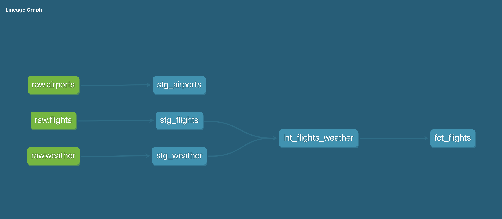

# transform — dbt Project

This dbt project is part of the **Flight & Weather Data Pipeline** and implements the transformation layer of the ELT architecture.

It reads raw data from BigQuery (`raw` dataset) and transforms it into clean, analytical models across two layers.

---

## Lineage Graph



## Project Structure

```
models/
├── staging/          # Clean and rename raw source data (views)
├── intermediate/     # Join and reshape for analytical use (views)
└── marts/            # Final analytical tables exposed to dashboards (tables)
```

## Layers

**Staging** — one model per source table. Renames columns to snake_case, casts data types, and selects only relevant columns. No business logic.

**Intermediate** — joins staging models together and applies light business logic (e.g. joining flights with weather by airport and date).

**Marts** — final fact and dimension tables. Materialised as tables for query performance. These are the models consumed by Looker Studio and notebooks.

---

## Sources

| Source | Dataset | Description |
|--------|---------|-------------|
| `raw.flights` | BTS On-Time Performance | All US domestic flights, Dec 2022 & Jan 2023 |
| `raw.weather` | Meteostat API | Daily weather observations per airport location |
| `raw.airports` | OpenFlights | Airport reference data with IATA codes and coordinates |

---

## Models

| Model | Layer | Description |
|--------|---------|-------------|
| `stg_flights` | Staging | Cleaned BTS flight data, one row per flight leg |
| `stg_weather` | Staging | Cleaned Meteostat daily weather observations |
| `stg_airports` | Staging | US airports filtered from OpenFlights reference data |
| `int_flights_weather` | Intermediate | Flights joined to weather by origin airport and date |
| `fct_flights` | Marts | Flight-level analytical table with derived cancellation flags |

---

## Running the project

```bash
# Run all models
dbt run

# Run a specific model
dbt run --select stg_flights

# Run all models in a layer
dbt run --select staging.*

# Test all models
dbt test

# Generate and serve documentation
dbt docs generate
dbt docs serve
```

## Context

This project analyses the impact of **Winter Storm Elliott** (December 2022) on US aviation, with a specific focus on the Southwest Airlines operational collapse. By joining flight performance data with historical weather observations, the pipeline surfaces the divergence between weather-driven cancellations and carrier-driven cancellations across airlines.